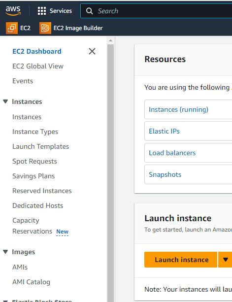
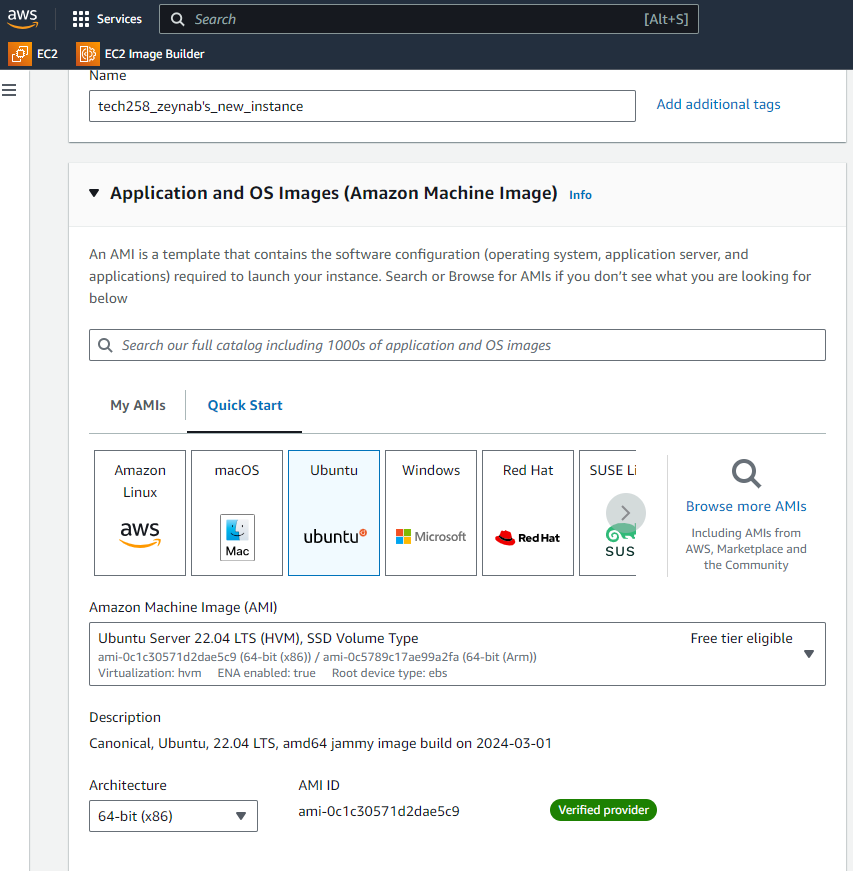
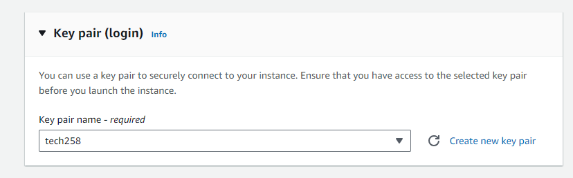
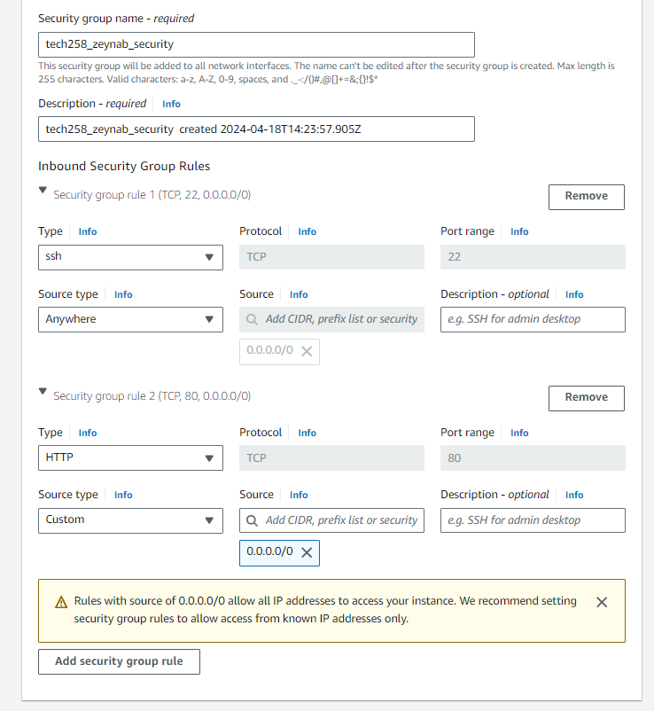
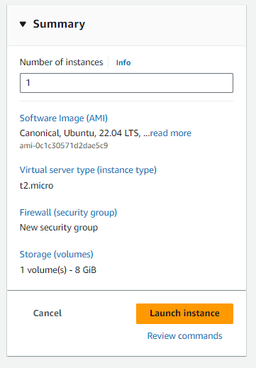
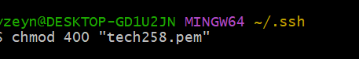
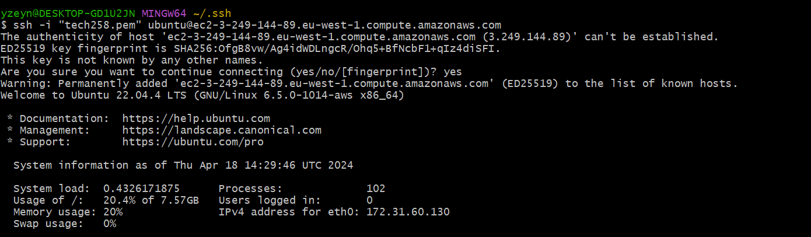
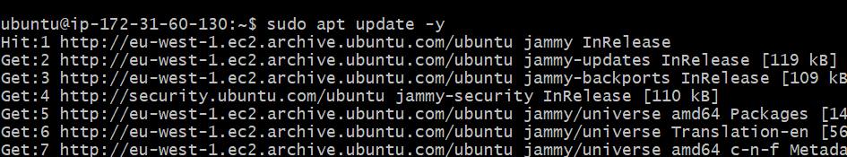
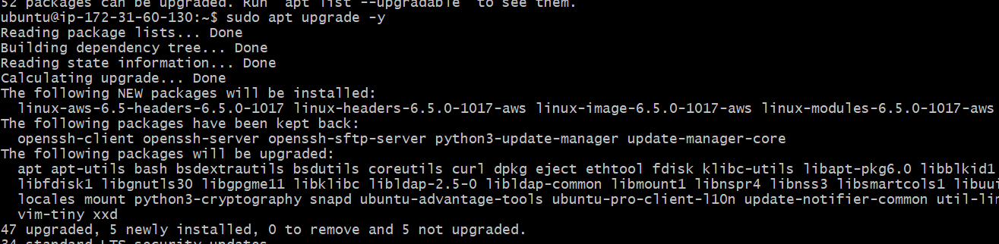
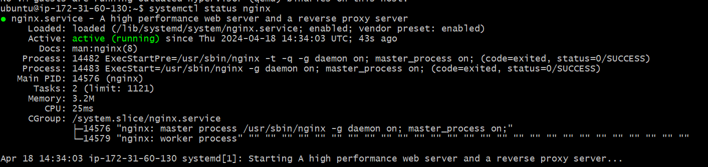

# Steps to launch EC2 instance in AWS

**What is EC2?**
Amazon Elastic Compute Cloud (EC2) is a web service provided by Amazon Web Services (AWS) that allows users to rent virtual servers (referred to as "instances") on which they can run their applications. EC2 instances are essentially virtual machines that can be launched in the cloud and scaled up or down as needed.

**Why do we need an EC2 instance?**

One of the main reasons we need EC2 instances is because they offer **scalability and flexibility**. We can launch EC2 instances **on demand and scale up or down** as needed to match our workload requirements. This means we can easily provision resources when we need them and only pay for what we use.

### Machine Images

- snapshots of virtual servers that contain the operating system, installed software, and configuration settings. 
- They are used to create new instances with identical configurations, enabling rapid deployment and scalability in cloud computing environments.


### Step 1-  Sign in to the AWS Management Console: 
- Login in to your AWS console
- Make sure you are in the correct region
- Navigate to the EC2 dashboard and click **Launch instance**
<br>


<br>
### Step 2- Choose a name of your instance: 
- Pick a name for your instance - make sure it's readable and identifies what this EC2 will do 
- Choose an Amazon Machine Image (AMI) - An Amazon Machine Image (AMI) is a pre-configured virtual machine that serves as a template for your EC2 instance. You'll be prompted to choose an AMI from a list of available options. You can choose from Amazon Linux, Ubuntu, Windows, and many other options.
- For this example I will be using **ubuntu**
- Choose an Instance Type: An instance type determines the computing resources (CPU, RAM, storage, etc.) available to your EC2 instance. There are a variety of instance types to choose from, ranging from small and low-cost to large and high-performance. Select the instance type that best fits your needs and budget.
- For this example I will use the t2 micro 

<br>


<br>
### Step 3- Create a key pair: 
- Create a key pair if you have never created one and store it in a safe place because it will act as a key to log in to your instance.



### Step 4- Configure Security Group:
- Security groups act as virtual firewalls for your EC2 instance, controlling inbound and outbound traffic. 
- You can configure security groups to allow or deny traffic from specific IP addresses, protocols, and ports. 
- They act as a barrier, **allowing only authorized traffic based on rules** defined by the user. 
- Ports are communication endpoints that define the type of traffic allowed through the security group, such as HTTP (port 80) or SSH (port 22).
- In this step, I have chosen HTTP and SSH 
- **SSH keys** are pairs of cryptographic keys used for secure authentication and communication between two networked devices. In this case, we use **SSH keys to securely connect to and manage instances in the cloud.**



### Step 5- Review and Launch: 
- Before launching your instance, review all the details to make sure everything is correct. 
- You can also modify any settings that need to be changed. Once you're ready, click the "Launch" button to start your EC2 instance.



### Step 6-  Connect to Your Instance:
- After launching your instance, you can connect to it using various methods, such as SSH or Remote Desktop Protocol (RDP). 
- I am using GitBash
- CD into your ./ssh file in your home directory 
- type: ```chomd 400 "nameofpemfile.pem""```  - **prevent the key from being publicly viewable.**




### Step 7 - Connect to the EC2 Instance::
- Once the instance is running, connect to it using SSH. You can use the terminal on your local machine to connect:
<br>





### Step 8- sudo apt update -y:
- This command can be broken down:
    - `sudo` - granting superuser (root) privileges to execute the command.
    - `apt` - The package management tool used for ubuntu
    - `update` - Refreshes the local package index from the repositories 
    - `-y` Automatically answers "yes" to all prompts. 
- Updates the local package  without requiring user interaction - latest information about available packages and their versions.


### Step 9- sudo apt upgrade -y:
- This command can be broken down:
  - `upgrade` - Installs the newest versions of all packages installed on the system
- This command upgrades all installed packages to their latest versions without requiring user interaction. 




### Step 10- Nginx :
- Install the Nginx web server using the command `sudo apt install nginx`.
- Check the status of the Nginx web server service on a Linux system. Using the command `systemctl status nginx`
-  The `status` subcommand retrieves and displays the current status of a specified service, such as Nginx, showing whether it's **running, stopped, or in another state**.



### Step 11-Access the File via Web Browser:
1. [x] copy and paste the ip address from your EC2 to you browser: 


